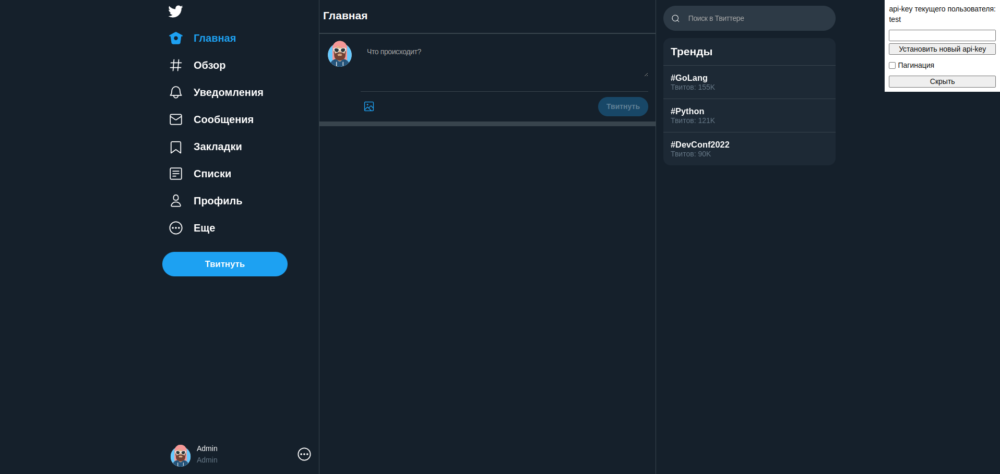

# FakeTwitter



## Структура проекта

### Проект состит из следующих частей

1. Приложения:

- `api` - В данной директории размещены файлы, относящиеся к API, включая конечные точки;
- `core` - В папке лежат файлы, касающиеся настроек приложения и безопасности;
- `db` - Эта директория предназначена для файлов, связанных с базой данных
- `static` - Директория для хранения статических файлов;
- `tests` - В данной папке размещаются тесты для проверки функциональности приложения;

## Установка проекта

1. Для приложения выполните следующие шаги:

```
git clone https://github.com/PskProduction/FakeTwitter.git
```

2. Необходимо создать и заполнить файл виртуального окружения `.env` по образцу `env.template`.

3. Запустите проект с помощью Docker Compose:

``` bash
docker compose up -d
```

Приложение будет доступно по адресу http://0.0.0.0:81

4. Остановить приложение и все сервисы:

``` bash
docker compose stop
```

При запуске приложения автоматически будут созданы 3 пользователя со следующими данными::

| Имя пользователя | api_key |
|------------------|---------|
| Admin            | test    |
| Vasiliy Pupkin   | test2   |
| Elon Musk        | Elon    |

## Тестирование
Чтобы запустить тесты, используйте команду:
```bash
pytest app/tests/test_app.py 
```

## Контракт для API

Названия роутов и ожидаемую структуру ответа от API endpoints можно найти в спецификации по адресу ниже (проект
при этом должен быть запущен):

```http request
http://0.0.0.0:81/docs
```